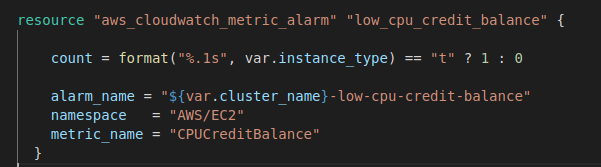
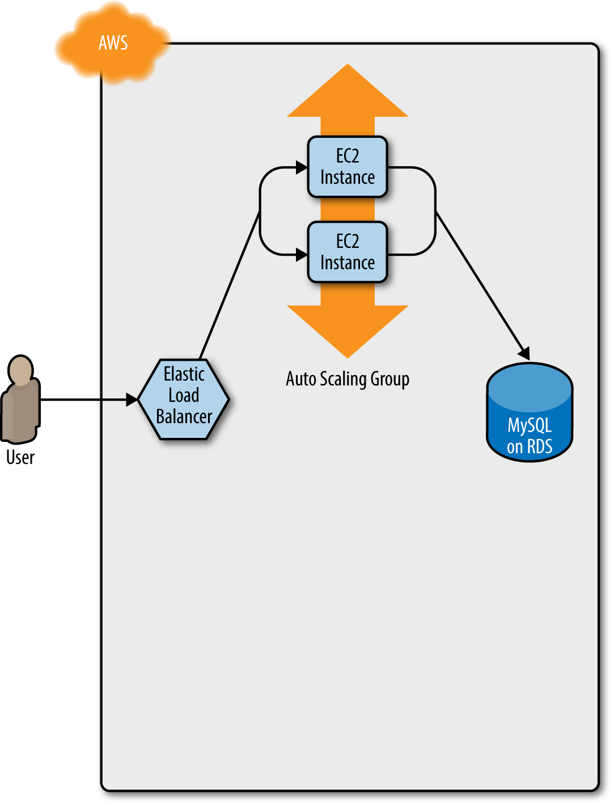
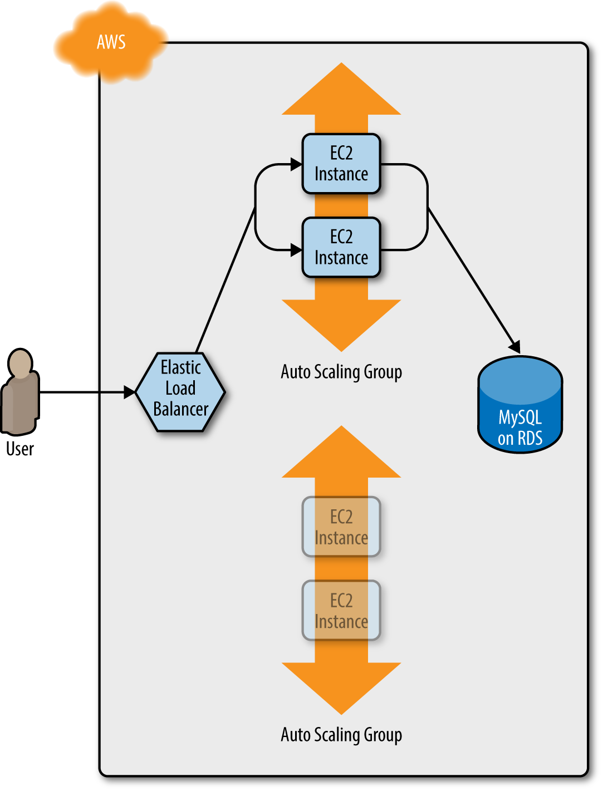
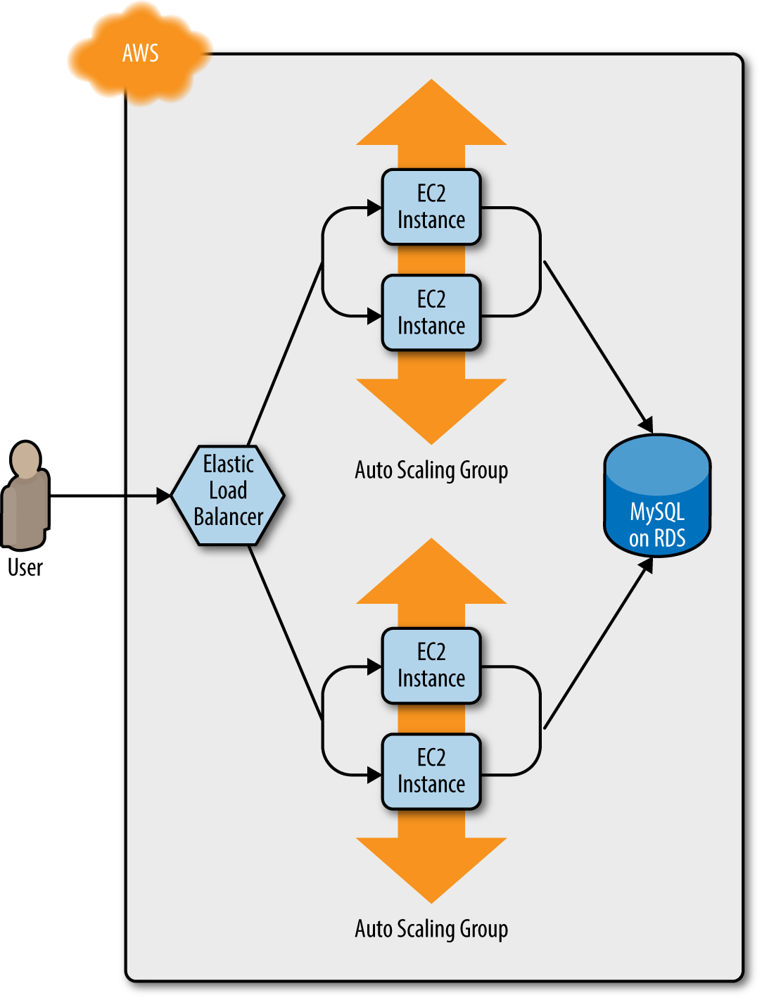
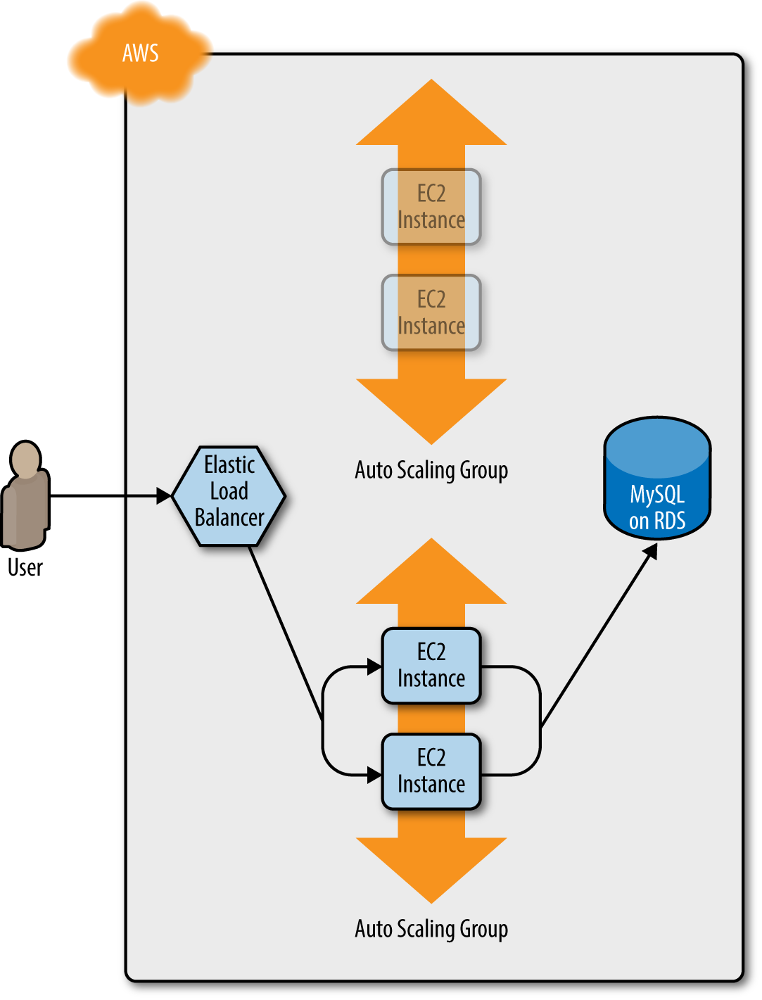
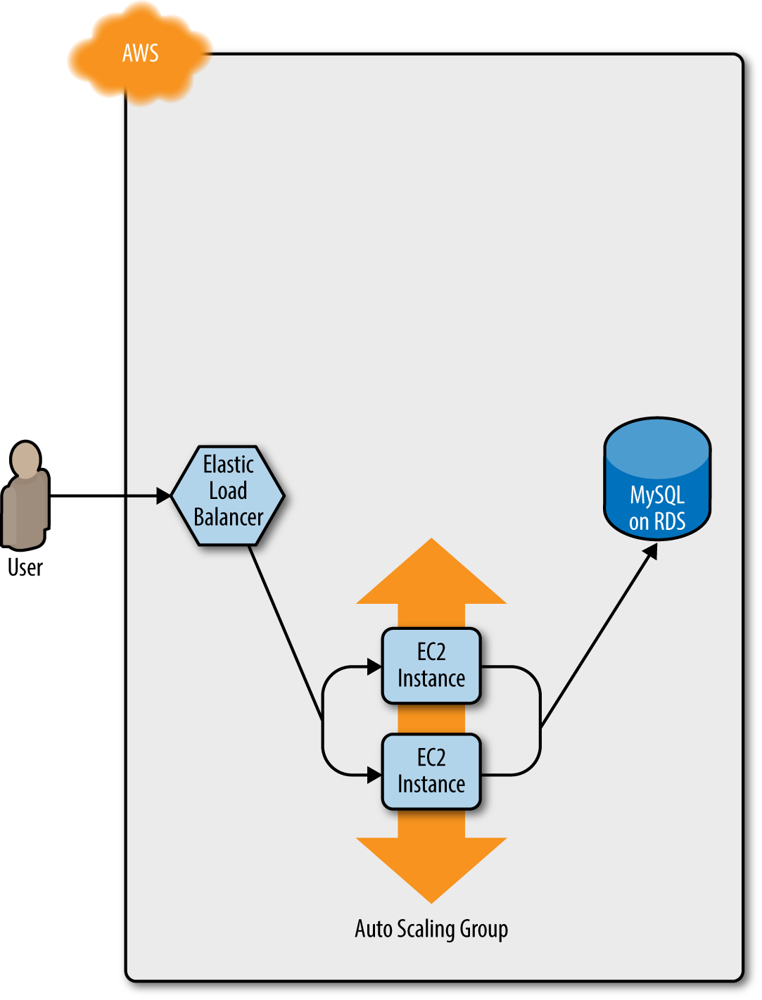

# 8. Terraform State


---

## Loops

Terraform has several loop constructs to provide looping functionality in different scenarios

- _count_ parameter: to loop over resources
- _for_each_ expressions: to loop over resources and inline blocks within a functionality
- _for_ expressions: to loop over lists and maps
- _for_ string directive: to loop over lists and maps withing a string

---

##  Loops with "count"

This was covered in Module 6

---

## Limitations of Count

_count_ can loop over resources but not inline blocks

For example, we cannot iterate over the inline block for `tag` to generate multiple tag blocks dynamically

Changing the values in a list modifies the created infrastructure which we saw in module 6.

-

## Loops with "for_each" Expressions

The for_each expression allows looping over lists, sets, and maps to create either:
- multiple copies of an entire resource, or
- multiple copies of an inline block within a resource

The previous example using `count` is now

```terrform
resource "aws_instance" "Matrix" {
for_each = toset(var.VM_names)
ami = "ami-0c101f26f147fa7fd"
instance_type = "t2.micro"
tags = {
Name = "VM-${each.value}"
}
}

variable "VM_names" {
type = list(string)
default = ["Neo",  "Morpheus", "Trinity"]
}
```

The function `toset()` converts the `var.user_names` list into a set
- `for_each` supports sets and maps only when used on a resource

When `for_each` loops each name in the list is made available in the `each` value
- The user name will also be available in `each.key`, but this is usually used only with maps of key/value pair.

Once `for_each` is used on a resource, it creates a map of resources rather than array of resources
- This is why we can't use a list with possible duplicates - it would lead to duplicate keys


## Map Advantages

Maps do not rely on position like lists do
- Allows us to remove items from the middle of a collection safely

Going back to the problem of deleting the middle machine with a map of resources we get the correct machine deleted because Terraform does not have to count through a list.

--- 

## Lab 9-1

---


## Inline Blocks with "for_each"

We may want to configure, for example, multiple sets of ingress rules from a standard set of configurations like:

```terraform
resource "aws_security_group" "example" {
  name        = "demo-simple"
  description = "demo-simple"

  ingress {
    description = "description 0"
    from_port   = 80
    to_port     = 80
    protocol    = "tcp"
    cidr_blocks = ["0.0.0.0/0"]
  }
  ingress {
    description = "description 1"
    from_port   = 81
    to_port     = 81
    protocol    = "tcp"
    cidr_blocks = ["0.0.0.0/0"]
  }
  tags = {
      Name = "for_each"
  }
}
```

## Reusable Ingress Rules

We can define reusable ingress rules, here with local variable which is a list of ingress rule terraform objects implemented as a dynamic block


```terraform
locals {  
  rules = [{
    description = "HTTP Port",
    port = 80,
    cidr_blocks = ["0.0.0.0/0"],
  },{
    description = "Custom Port",
    port = 81,
    cidr_blocks = ["10.0.0.0/16"],
  }]
}

resource "aws_security_group" "for_each" {
  name        = "Dynamic"
  description = "Dynamic Inline Block"

  dynamic "ingress" {
    for_each = local.rules
    content {
      description = ingress.value.description
      from_port   = ingress.value.port
      to_port     = ingress.value.port
      protocol    = "tcp"
      cidr_blocks = ingress.value.cidr_blocks
    }
  }
    tags = {
      Name = "Dynamic"
    } 
  }

```


## Looping with Expressions

Terraform allows operations on the data similar to operations in a programming language

Syntax is:

```terraform
  [for < ITEM > in < LIST > : < OUTPUT >]
 ```
Demonstrated in this code:

```terraform
 variable "names" {
    description = "A list of names"
    type        = list(string)
    default     = ["neo", "trinity", "morpheus"]
  }

  output "upper_names" {
     value = [for name in var.names : upper(name)]
  } 

  output "short_upper_names" {
    value = [for name in var.names : upper(name) if length(name) < 5]
  } 


```

## Working with Map Inputs

The for expression can loop over a map as well
  ```
  [for < KEY >, < VALUE > in < MAP > : < OUTPUT >]
  ```

Example of use:

```terraform
variable "hero_thousand_faces" {
description = "map"
type        = map(string)
default     = {
neo      = "hero"
trinity  = "love interest"
morpheus = "mentor"
}
}

output "bios" {
value = [for name, role in var.hero_thousand_faces : "${name} is the ${role}"]
}

output "upper_roles" {
value = {for name, role in var.hero_thousand_faces : upper(name) => upper(role)}
}
```

### Outputing a Map

Looping over a list or map can output a map using the syntax:

```terraform
// Loop over a map and output a map
{for < KEY >, < VALUE > in < MAP > : < OUTPUT_KEY > => < OUTPUT_VALUE >}
```

Revisting the example

```terraform

variable "hero_thousand_faces" {
  description = "map"
  type        = map(string)
  default     = {
    neo      = "hero"
    trinity  = "love interest"
    morpheus = "mentor"
    }
}

output "bios" {
  value = [for name, role in var.hero_thousand_faces : "${name} is the ${role}"]
}

 output "upper_roles" {
    value = {for name, role in var.hero_thousand_faces : upper(name) => upper(role)}
  }

```  

## Loops with the "for" String Directive

String directives allow for-loops and if-statements in strings using a syntax similar to string interpolations
  but instead of a dollar sign and curly braces (${...}), it uses a percent sign and curly braces (%{...})

Terraform supports two types of string directives:
      for-loops and conditionals

For loop syntax (collection is a list or map)

```terraform
  %{ for < ITEM > in < COLLECTION > }< BODY >%{ endfor }
```

```terraform

variable "names" {
  description = "Names to render"
  type        = list(string)
  default     = ["neo", "trinity", "morpheus"]
}

output "for_directive" {
  
  value = <<EOF
%{ for name in var.names }
  ${name}
%{ endfor }
EOF
}


output "for_directive_strip_marker" {

  value = <<EOF
%{~ for name in var.names }
  ${name}
%{~ endfor }
EOF
}
```


## Trimming Whitespace

A strip marker (~) in your string directive consumes all of the whitespace (spaces and newlines) either before the string directive (if the marker appears at the beginning of the string


## Conditionals

There are also several different ways to do conditionals, each intended to be used in a slightly different scenario:
- count parameter*: Used for conditional resources

- for_each and for expressions: Used for conditional resources and inline blocks within a resource

- if string directive: Used for conditionals within a string


## Conditionals with "count"


We can define a Boolean variable as our test condition "enable_autoscaling"

We can set the count on a resource to "0" which means that resource is not created 

Terraform allows ternary conditionals of the form:

```Terraform
  < CONDITION > ? < TRUE_VAL > : < FALSE_VAL >
```

This allows for conditional creation of resources:

```terraform
variable "make_VM" {
  type = bool
}

resource "aws_instance" "VM" {
    count = var.make_VM ? 1 : 0
    ami = "ami-077e31c4939f6a2f3"
    instance_type = "t2.micro"
    tags = {
        Name = "Conditional"
    }
}
```

## Working with Non-boolean

The previous example worked because we could define a boolean variable
- However, we may have to decode information in a string to make a decision

Example: We want to set a cloud-watch alarm that triggers when CPU credits are low
- However, CPUcredits only "txxx" instances
- Larger instance like m4.large do not return a CPU credit metric and will always appear to be in an INSUFFICIENT_DATA state
- We want the metric to apply to only txxx instance but we don't want to create a special Boolean
- The solution is to utilize the fact that first letter of the instance type should be a "t"



The format function to extract just the first character from var.instance_type.
- If that character is a "t" (e.g., t2.micro), it sets the count to 1;
- otherwise, it sets the count to 0
- This way, the alarm is created only for instance types that actually have a CPUCreditBalance metric.


## Zero-Downtime Deployment

The challenge is to update a cluster without causing downtime for users
* How do you deploy a new Amazon Machine Image (AMI) across the cluster?

If we are deploying a new version of our app, we don't want there to be downtime as we switch over

We full test and deploy our app in a test are to ensure it is working before we make the transition

We then deploy the application into a new launch configuration which will be the target of the auto-scaling group

However the challenge is switching launch configurations, if destroy the old one, then we have downtime while the new one is being created

The way to accomplish that is to create the replacement ASG first and then destroy the original one

Configure the name parameter of the ASG to depend directly on the name of the launch configuration

Each time the launch configuration changes (which it will when you update the AMI or User Data), its name changes, and therefore the ASG's name will change, which forces Terraform to replace the ASG

Set the create_before_destroy parameter of the ASG to true, so that each time Terraform tries to replace it, it will create the replacement ASG before destroying the original

Set the min_elb_capacity parameter of the ASG to the min_size of the cluster so that Terraform will wait for at least that many servers from the new ASG to pass health checks in the ALB before it will begin destroying the original ASG


## Zero-Downtime Deployment 1

Initially, you have the original ASG running v1 of your code

  


## Zero-Downtime Deployment 2

Terraform begins deploying the new ASG with v2 of your code

  

---
## Zero-Downtime Deployment 3

The servers in the new ASG boot up, connect to the DB, register in the ALB, and begin serving traffic




## Zero-Downtime Deployment 4

The servers in the old ASG begin to shut down



---
## Zero-Downtime Deployment 5

Now, only the new ASG remains, which is running v2 of your code



---

## Terraform Gotchas

We now take a step back and point out a few gotchas

count and for_each have limitations
* You cannot reference any resource outputs in count or for_each
* You cannot use count or for_each within a module configuration

Zero-downtime deployment has limitations
* it doesn't work with auto scaling policies
* it resets your ASG size back to its min_size after each deployment

Valid plans can fail
-Terraform only looks at resources in the state file and doesn't take into account other resources
- Plans that look good may fail because of resource conflicts
* Ideally infrastructure should only rely on Terraform
* And import existing infrastructure

## Terraform Gotchas

Refactoring can be tricky
* Changes can have major effects
* Changing the name parameter of certain resources will delete the old version of the resource and create a new version to replace it (immutable infrastructure)

Refactoring points:
* Always use the plan command
* Create before destroy
* Keep in mind that changing identifiers requires changing state
* Some parameters are immutable so changing them requires replacing the resource
* Eventual consistency is consistent...  eventually

APIs for some cloud providers, such as AWS, are asynchronous and eventually consistent
* Asynchronous means that the API might send a response immediately, without waiting for the requested action to complete
* Eventually consistent means that it takes time for a change to propagate throughout the entire system
* For some period of time, you might get inconsistent responses depending on which data store replica happens to respond to your API calls

Generally, re-running _terraform apply_ solves the problem


