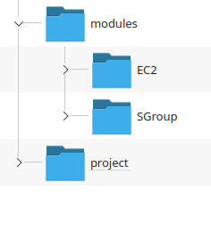

# Lab AWS 7-2 - Modules Continued

---

## Set Up

This lab is a continuation of the previous lab.


## Step One -  Add Module

Add a SGroup folder the same way that you added the EC2 Module



The module has three files corresponding to the input to the module, the return values and the actual code.

### Add inputs

Create a `variables.tf` file to hold the inputs.

```terraform
variable "access_port" {
    description = "Access port to use for the application"
    type = number
    default = 80
}

variable "sg_name" {
    description = "The name of the security group"
    type = string
    default = "my_sg"
}
```

### Add Outputs

Create an `outputs.tf` file that defines the return value

```terraform
output "secgps" {
    value =aws_security_group.app_port.id
    description = "Returns the id of the security group"
}
```

### Add Module

And finally, add the code in `main.tf` that actually creates the security group

```terraform
resource "aws_security_group" "app_port" {
    description = " Security group to allow access app instance"
    ingress {
    description = "OpenPort"
    from_port   = var.access_port
    to_port     = var.access_port
    protocol    = "tcp"
    cidr_blocks = ["0.0.0.0/0"]
  }

  egress {
    from_port   = 0
    to_port     = 0
    protocol    = "-1"
    cidr_blocks = ["0.0.0.0/0"]
  }

  tags = {
    Name = var.sg_name
  }
}
```

## Part Two - Modify the EC2 Module

The EC2 module does not define a security group so we add it.

First we add the input variable that takes a security group ID to the existing `variables.tf`

```terraform
variable "ami_type" {
    type = string
    default = "ami-080e1f13689e07408"
}

variable "inst_type" {
    type = string
    default = "t2.nano"
}

variable VM_name {
    type = string
    default = "EC2-Module"
}

variable "sg_groups" {
    description = "Associated security groups"
    type = string
}
```

Then add the attribute that uses this input to link the security group to the `main.tf` file

```terraform
resource "aws_instance" "alpha" {
    ami = var.ami_type
    instance_type = var.inst_type
    tags = {
        source = "EC2 Module"
        Name = var.VM_name
    }

    vpc_security_group_ids = [var.sg_groups]
}
```

## Step Three - Link the application

In the `main.tf` file, we create the call to the SGroup module so that the id of the security group created is now in the SGroup output variable.

```terraform
module "SG" {
  source = "../modules/SGroup"
  access_port = 8080
  sg_name = "My Demo"
}
```

We now add a line in the call to the EC2 module to set the value for the new input variable we have created.

```terraform
module "vm" {
    count = length(var.names)
    source = "../modules/EC2"
    ami_type = var.amis[count.index]
    inst_type = var.insts[count.index]
    VM_name = var.names[count.index]
    sg_groups = module.SG.secgps
  }
```

---